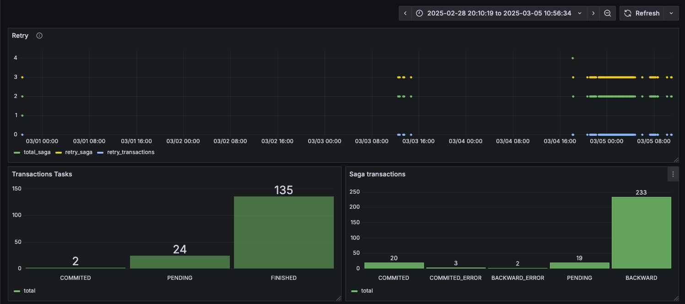

# OrchestratorX - Backend and Plarform Framework


A robust Go library designed to simplify distributed transactions in microservices architecture. It provides:

- Saga Pattern implementation with orchestrator
- Message queue integration
- Transaction monitoring and tracking
- Automatic cleanup of old transactions
- Built-in Grafana dashboards
- Easy-to-use SDK for producers and consumers

### INSTALL

```shell
go get -u github.com/IsaacDSC/event-driven
```


### Functionalities

---
##### EventDriven 
| Description | Resource | Link                                                                                            |
|------------|----------|-------------------------------------------------------------------------------------------------|
| Examples with producer and consumer | Queue Example | [main.go](https://github.com/IsaacDSC/event-driven/blob/main/internal/example/queue/main.go)    |
| Examples with producer and consumer | Saga Pattern Example | [folder checkout](https://github.com/IsaacDSC/event-driven/tree/main/internal/example/checkout) |
---
##### Monitoring
| Description | Resource | Link |
|------------|----------|------|
| Default configurations | Grafana Dashboard | [dashboard.json](https://github.com/IsaacDSC/event-driven/blob/main/grafana/dashboard.json) |
| Default configurations | Datasource | [datasources.yaml](https://github.com/IsaacDSC/event-driven/blob/main/grafana/provisioning/datasources/datasources.yaml) |
---
##### Repository
| Description | Resource | Link |
|------------|----------|------|
| Repository to save transactions implement contract | Postgres | [transaction.go](https://github.com/IsaacDSC/event-driven/blob/main/repository/transaction.go) |
| Schema database | Tables | [schema.sql](https://github.com/IsaacDSC/event-driven/blob/main/internal/sqlc/schema.sql) |
| Cronjob to clean infos default 1 Month | Cronjob | [cronjob.sql](https://github.com/IsaacDSC/event-driven/blob/main/internal/sqlc/cronjob.sql) |
--- 
##### Others Settings 
| Description | Resource | Link |
|------------|----------|------|
| Types and configs - Repository Interface | Interface | [acl.go](https://github.com/IsaacDSC/event-driven/blob/main/types/acl.go) |
| Types and configs - Opts and Payload | Types | [payload.go](https://github.com/IsaacDSC/event-driven/blob/main/types/payload.go) |


### Dashboard



- SERVER HTTP
    - Save transactions on database
    - Dashboard to monitor transactions
    - Removed transaction every (30 Days)


### SAGA PATTERN - ORCHESTRATOR

*Use Repository to monitoring queues*

#### Init project
```shell
go mod init eventdrivenexample
```

```shell
touch main.go
```

```shell
go get -u github.com/IsaacDSC/event-driven
```

#### Create tables on pgDatabase
- 1.1 Download this schema and running in to database
```shell
wget https://github.com/IsaacDSC/event-driven/blob/main/internal/sqlc/schema.sql
```

#### Create instance repository `main.go`

```go
package main

import (
	"context"
	"event-driven/SDK"
	"event-driven/internal/example/checkout/domains"
	"event-driven/repository"
	"event-driven/types"
	"time"
)

const connectionString = "user=root password=root dbname=event-driven sslmode=disable"

func main() {
	repo, err := repository.NewPgAdapter(connectionString)
	if err != nil {
		panic(err)
	}

	defer repo.Close()
}
```

#### Producer message example

*Create file `producer.go`*
```shell
mkdir producer && touch producer/producer.go
```

*Add code this file `producer.go`*
```go 
package producer

import (
	"context"
	"event-driven/SDK"
	"event-driven/internal/example/checkout/domains"
	"event-driven/repository"
	"event-driven/types"
	"time"
)

func producer(repo types.Repository) {
	pd := SDK.NewProducer(rdAddr, repo, &types.Opts{
		MaxRetry: 5,
		DeadLine: time.Now().Add(15 * time.Minute),
	})

	input := map[string]any{
		"order_id":     "79a369da-0d71-4e3f-b504-e1f793220e60",
		"client":       "John Doe",
		"client_email": "john_doe@gmail.com",
		"products": []map[string]any{
			{
				"product_id": "79a369da-0d71-4e3f-b504-e1f793220e60",
				"quantity":   1,
				"price":      100.00,
			},
			{
				"product_id": "79a369da-0d71-4e3f-b504-e1f793220e60",
				"quantity":   3,
				"price":      400.00,
			},
		},
		"total":  500.00,
		"status": "pending",
	}

	if err := pd.SagaProducer(context.Background(), EventCheckoutCreated, input); err != nil {
		return err
	}

}
```

### Consumers message example

*Create file `consumer.go`*
```shell
mkdir consumer && touch consumer/consumer.go
```

*Add code this file `consumer.go`*

```go
package consumer

import (
	"context"
	"event-driven/SDK"
	"event-driven/internal/example/checkout/domains"
	"event-driven/repository"
	"event-driven/types"
	"time"
)

const rdAddr = "localhost:6379"

func consumer(repo types.Repository) error {
	sgPayment := domains.NewPayment()
	sgStock := domains.NewStock()
	sgDelivery := domains.NewDelivery()
	sgNotify := domains.NewNotify()

	sp := SDK.NewSagaPattern(rdAddr, repo, []types.ConsumerInput{
		sgPayment,
		sgStock,
		sgDelivery,
		sgNotify,
	}, types.Opts{
		MaxRetry: 3,
	}, false)

	if err := sp.WithConsumerServer(rdAddr, repo).AddHandlers(map[string]types.ConsumerFn{
		EventCheckoutCreated: sp.Consumer,
	}).Start(); err != nil {
		return err
	}

	return nil
}
```
